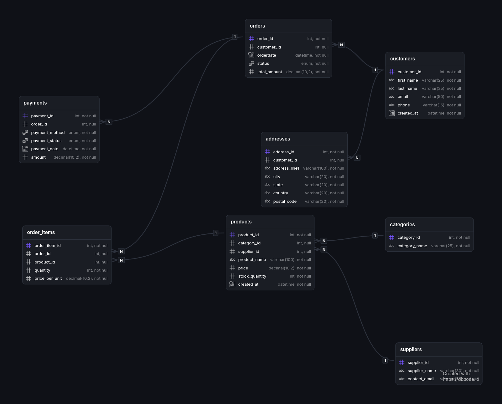

# E-Commerce Database Project

## Overview
This project models a robust relational database for an e-commerce platform. It demonstrates the ability to design a normalized database schema with proper constraints, automate the generation of realistic mock data using Python and Faker, and perform advanced business analytics using complex SQL queries. The project is designed to replicate real-world data engineering and analysis workflows.

## Features
* **Relational Schema:** A fully normalized database schema representing customers, products, orders, and payments.
* **Automated Data Generation:** Python scripts leveraging the `Faker` library to seed the database with realistic mock data.
* **SQL Analytics:** Comprehensive business intelligence queries to extract key insights.
* **Advanced SQL:** Practical usage of Common Table Expressions (CTEs), Window Functions, and subqueries.
* **Business Reporting:** Ready-to-use business reports for sales, customers, products, and payments.

## Tech Stack
* MariaDB
* SQL
* Python
* Faker
* Git

## Project Structure
```text
.
├── apps/
├── assets/
│   ├── er_diagram.png
│   └── screenshots/
├── docs/
├── queries/
│   ├── CTE_1.sql
│   ├── CTE_2.sql
│   ├── category_analysis.sql
│   ├── customer_analysis.sql
│   ├── payment_analysis.sql
│   ├── product_analysis.sql
│   ├── reports.sql
│   ├── revenue_analysis.sql
│   ├── supplier_analysis.sql
│   └── win_func.sql
├── schema/
│   ├── constraints.sql
│   ├── create_tables.sql
│   ├── insert_test_data.sql
│   └── test_fk_constraint.sql
├── seed/
│   ├── generate_addresses.py
│   ├── generate_categories.py
│   ├── generate_customers.py
│   ├── generate_order_items.py
│   ├── generate_orders.py
│   ├── generate_payments.py
│   ├── generate_products.py
│   └── generate_suppliers.py
├── .env.example
├── .gitignore
└── requirements.txt
```

## Database Schema
The database consists of the following primary tables:
* `customers`: Stores customer details (name, email, phone).
* `addresses`: Stores customer locations.
* `categories`: Organizes products into specific categories.
* `suppliers`: Tracks product suppliers and their contact information.
* `products`: The catalog of items being sold.
* `orders`: Tracks customer purchases and their current statuses.
* `order_items`: Line items for each order, linking products with quantities.
* `payments`: Records transaction details, payment methods, and statuses.

## Entity Relationship Diagram


## Dataset
The dataset is dynamically generated using the provided Python scripts in the `seed/` directory. By executing these scripts, the tables are populated with synthetic but highly realistic data, allowing for robust query testing and performance tuning.

## SQL Concepts Demonstrated
* Joins
* Aggregations
* Subqueries
* Common Table Expressions (CTEs)
* Window Functions
* Ranking (`RANK()`, `ROW_NUMBER()`)
* Running Totals (`SUM() OVER()`)

## Business Reports
The `queries/reports.sql` file contains analytical queries for various business segments:

* **Sales Reports:** Monthly revenue, running monthly revenue, revenue by category, and a sales leaderboard.
* **Customer Reports:** Top customers by spending, customer lifetime spending, average customer spend, and the latest order per customer.
* **Product Reports:** Top selling products, the top product in each category, products never purchased, and monthly revenue trends.
* **Payment Reports:** Payment method distribution, refund percentages, and orders without successful payments.
* **Supplier Reports:** Total revenue generated by each supplier.

## Setup Instructions
1. **Clone the repository:**
   ```bash
   git clone <repository-url>
   cd ecomm_project
   ```

2. **Configure Environment:**
   Create a `.env` file based on the provided `.example` file:
   ```bash
   cp .env.example .env
   ```
   Update the `.env` file with your database credentials.

3. **Install Requirements:**
   Create a virtual environment and install the required Python packages:
   ```bash
   python -m venv .venv
   source .venv/bin/activate
   pip install -r requirements.txt
   ```

4. **Initialize Database:**
   Execute the schema scripts in your MariaDB database to set up the tables and constraints:
   ```bash
   mysql -u your_username -p < schema/create_tables.sql
   mysql -u your_username -p ecomm_db < schema/constraints.sql
   ```

## Running the Project
Once the schema is set up, run the seed scripts to populate the tables in order:
```bash
python seed/generate_customers.py
python seed/generate_addresses.py
python seed/generate_categories.py
python seed/generate_suppliers.py
python seed/generate_products.py
python seed/generate_orders.py
python seed/generate_order_items.py
python seed/generate_payments.py
```

Finally, execute the business reports to generate insights:
```bash
mysql -u your_username -p ecomm_db < queries/reports.sql
```

## Future Improvements
* Add database indexes to optimize slow analytical queries.
* Create stored procedures for common business reporting tasks.
* Integrate a BI dashboard tool for visual reporting.
* Build a REST API for real-time data access.
